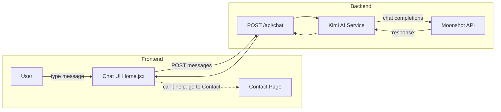

# Kimi AI Chatbot Integration Plan

## Current State

- [Home.jsx](src/Home.jsx) (lines 286-356): Chat UI with local-only messages; `sendMessage()` only appends to `messages` state; no backend call
- [Contact.jsx](src/Contact.jsx): Sends messages to admin via `api.messages.create()` (requires auth)
- [api.js](src/api.js): `messages.create(body)` posts to `/api/messages`
- Backend: `POST /api/messages` creates a Message (auth required)

## Architecture




## 1. Backend Changes

### 1.1 Configuration

Add to `appsettings.json` and `appsettings.Development.json`:

```json
"Kimi": {
  "ApiKey": "your-moonshot-api-key",
  "BaseUrl": "https://api.moonshot.ai/v1",
  "Model": "kimi-k2-turbo-preview"
}
```

### 1.2 Kimi Chat Service

Create `LeafScan.Infrastructure/Services/KimiChatService.cs`:

- Accept `messages` (list of `{ role, content }`) and `language` (en/ar)
- Build system prompt with LeafScan website context:
  - About: AI plant diagnosis, leaf health
  - Services: Vital signs, soil detection, crop recommendation, irrigation calculator
  - Contact: address, email, phone
  - Instruction: when you cannot answer or fulfill the request, say: "I can't help with that. Please go to Contact Us and send your message to our team."
- Call Moonshot API: `POST https://api.moonshot.ai/v1/chat/completions` (OpenAI-compatible)
- Return assistant message content

### 1.3 Chat Controller

Create `LeafScan.API/Controllers/ChatController.cs`:

- `POST /api/chat` – body: `{ messages: [{ role, content }], language?: string }`
- Auth: required (same as messages)
- Calls `KimiChatService`, returns `{ content: string }`

### 1.4 Files to Create/Modify


| File                                                                | Action                   |
| ------------------------------------------------------------------- | ------------------------ |
| `LeafScan.Infrastructure/Services/IKimiChatService.cs`              | Create interface         |
| `LeafScan.Infrastructure/Services/KimiChatService.cs`               | Create implementation    |
| `LeafScan.Infrastructure/Extensions/ServiceCollectionExtensions.cs` | Register KimiChatService |
| `LeafScan.API/Controllers/ChatController.cs`                        | Create                   |
| `appsettings.json`, `appsettings.Development.json`                  | Add Kimi config          |


### 1.5 Website Context (System Prompt)

Static text injected into the system prompt:

- LeafScan: plant health AI, diagnosis from images
- Services: Plant diagnosis, crop recommendation, irrigation calculator
- Contact: address, email, phone
- Fallback: "If you cannot help, tell the user to go to Contact Us and send their message to admin."

---

## 2. Frontend Changes

### 2.1 API Client

Add to [api.js](src/api.js):

```js
chat: {
  send: (messages, language) => api.post('/chat', { messages, language }),
},
```

### 2.2 Home.jsx Chat Logic

Replace [Home.jsx](src/Home.jsx) (lines 286-356) with:

1. **Message structure**:
  - `{ role: 'user' | 'assistant', content: string }` (keep `type` for audio if needed later)
2. **sendMessage**:
  - Append user message to `messages`
  - Set `loading` state
  - Call `api.chat.send(messagesWithNew, i18n.language)`
  - Append assistant response to `messages`
  - Set `loading` false
3. **UI**:
  - Keep existing layout (header, chat area, input area)
  - Show user messages on one side, assistant on the other
  - Show loading indicator while waiting for Kimi
  - Remove or simplify mic recording (optional: keep for future)
4. **Fallback**:
  - When Kimi returns text containing "Contact Us" or similar, optionally show a "Contact admin" button that navigates to `/contact-us` with a pre-filled message

### 2.3 i18n

Add keys if needed:

- `chat_placeholder`: "Type your message..."
- `chat_loading`: "AI is thinking..."
- `chat_contact_admin`: "Contact our team" (for fallback CTA)

---

## 3. Implementation Order

1. Backend: Add Kimi config, `IKimiChatService`, `KimiChatService`
2. Backend: Add `ChatController`
3. Backend: Register services
4. Frontend: Add `api.chat.send`
5. Frontend: Update Home.jsx `sendMessage` and chat UI
6. Test: Send message, verify Kimi response, fallback flow

---

## 4. Kimi API Reference

- Base URL: `https://api.moonshot.ai/v1`
- Endpoint: `POST /chat/completions`
- Auth: `Authorization: Bearer {api_key}`
- Body (OpenAI format): `{ model, messages, temperature }`
- Docs: [https://platform.moonshot.ai/docs/guide/start-using-kimi-api](https://platform.moonshot.ai/docs/guide/start-using-kimi-api)

---

## 5. Security Notes

- Kimi API key must stay in backend (appsettings, env vars)
- Chat endpoint requires JWT auth (same as messages)
- Rate limiting recommended for production

